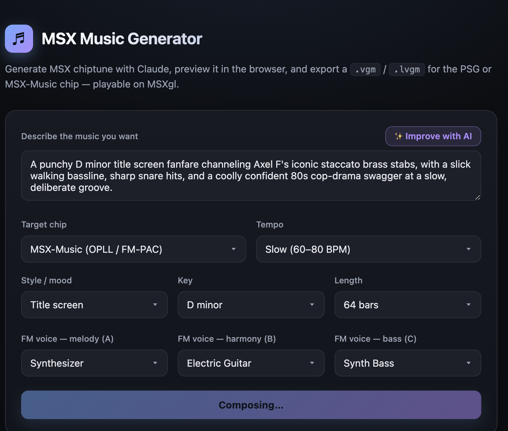
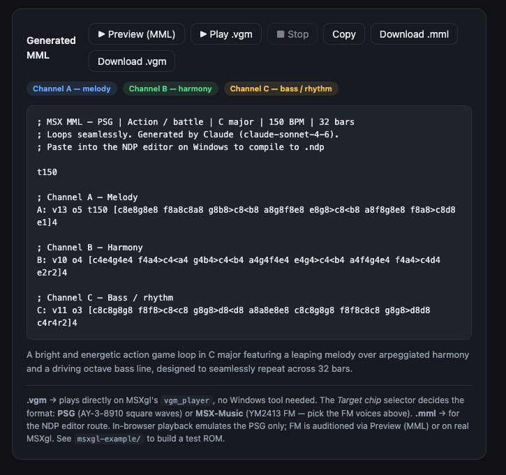

# MSX MML Music Generator

A small, dependency-free local web app that:

1. **Generates** MSX chiptune as **MML** using Claude,
2. lets you **preview it in the browser** (Web Audio square-wave synthesis), and
3. **exports** a ready-to-play `.vgm` for [MSXgl](https://github.com/aoineko-fr/MSXgl)'s `vgm_player` — for either the **PSG** (AY-3-8910 square waves) or **MSX-Music** (YM2413 FM) chip — a fully macOS-native path with no Windows tools. It can also emit `.mml` for the NDP toolchain.

A bundled **[MSXgl example](msxgl-example/)** turns any exported `.vgm` into a runnable MSX ROM.

> ⚠️ **Tested on macOS only** (Node 24, openMSX 21, Apple Silicon). The app is plain Node + browser and the formats are standard, so Windows and Linux are expected to work — but those instructions are provided for completeness and have **not** been verified. Reports and fixes welcome.

| Describe & choose the chip | Generated MML — preview & export |
|:--:|:--:|
|  |  |

```
                          ┌─ PSG .vgm  ─┐
Claude ─→ MML ─→ [app] ─┤               ├─→ MSXgl vgm_player ─→ ROM ─→ real MSX / openMSX
                          └─ FM  .vgm  ─┘   (see msxgl-example/)
                        └─ .mml ─→ NDP editor (Windows) ─→ .ndp ─→ ndp_player   (alt route)
```

## Documentation

| Doc | What's in it |
|-----|--------------|
| **README.md** (this file) | Overview, setup, usage, troubleshooting |
| [msxgl-example/](msxgl-example/) | Ready-to-build MSXgl ROM that plays an exported `.vgm` (PSG or FM) |
| [docs/ARCHITECTURE.md](docs/ARCHITECTURE.md) | How the code is structured and how to extend it |
| [docs/MML-REFERENCE.md](docs/MML-REFERENCE.md) | The MML syntax the parser understands |
| [docs/VGM-FORMAT.md](docs/VGM-FORMAT.md) | How the VGM exporters (PSG + MSX-Music) work + MSXgl integration |
| [docs/PIPELINE.md](docs/PIPELINE.md) | Why VGM was chosen over NDP/others (the research behind it) |
| [msxgl_music_context.md](msxgl_music_context.md) | Original project brainstorm and the early NDP pipeline notes (historical) |

## Requirements

- **Node 20.12+** (uses `process.loadEnvFile`; tested on Node 24). No `npm install` — there are zero runtime dependencies.
- An **Anthropic API key** ([console.anthropic.com/settings/keys](https://console.anthropic.com/settings/keys)). API usage is billed per token; this app uses small requests (a fraction of a cent each), but the account needs billing/credit set up.
- A modern browser (Web Audio + ES modules).

## Setup & run

The web app is plain Node + a browser, so it runs the same on **macOS, Windows, and Linux**. The only per-OS differences are how you install Node and how you set the API key. (Verified on macOS; the Windows/Linux commands below are unverified — see the note at the top.)

### 1. Install Node 20.12+

| OS | Install |
|----|---------|
| **macOS** | `brew install node` — or the installer from [nodejs.org](https://nodejs.org). |
| **Windows** | `winget install OpenJS.NodeJS` (or `choco install nodejs-lts`) — or the installer from [nodejs.org](https://nodejs.org). |
| **Linux** | Distro package (`sudo apt install nodejs npm`, `sudo dnf install nodejs`, …) — but check `node -v` ≥ 20.12; if older, use [nvm](https://github.com/nvm-sh/nvm) (`nvm install --lts`) or [NodeSource](https://github.com/nodesource/distributions). |

Verify: `node -v`.

### 2. Set your API key

Get a key from [console.anthropic.com/settings/keys](https://console.anthropic.com/settings/keys), then either create a `.env` file or export an environment variable:

| OS / shell | Create `.env` | …or set for the session |
|------------|---------------|--------------------------|
| **macOS / Linux** (bash/zsh) | `cp .env.example .env` then edit | `export ANTHROPIC_API_KEY=sk-ant-...` |
| **Windows PowerShell** | `copy .env.example .env` then edit | `$env:ANTHROPIC_API_KEY="sk-ant-..."` |
| **Windows cmd** | `copy .env.example .env` then edit | `set ANTHROPIC_API_KEY=sk-ant-...` |

Edit `.env` so the line reads `ANTHROPIC_API_KEY=sk-ant-...`. It's gitignored and read only by the server — the key never reaches the browser.

### 3. Run

```bash
npm start            # all platforms (equivalently: node server.js)
```

Open **http://localhost:5173**.

### Configuration

Set in `.env` or the environment:

| Variable | Default | Purpose |
|----------|---------|---------|
| `ANTHROPIC_API_KEY` | _(required)_ | Your Anthropic API key |
| `PORT` | `5173` | HTTP port |
| `MSX_MODEL` | `claude-opus-4-8` | Claude model used to compose (Opus for best quality; set `claude-sonnet-4-6` for faster/cheaper) |
| `MSXZIP` | _(unset)_ | Path to MSXgl's MSXzip binary. When set, enables the **Download .lvgm** button (see below). |

### Optional: in-app lVGM export

[lVGM](msxgl-example/#smaller-roms-with-lvgm) is a compact, MSX-optimized VGM (~75–85% smaller). Encoding it requires MSXgl's **MSXzip** tool, so it's off by default. To enable a **Download .lvgm** button in the UI, point `MSXZIP` at the binary from your MSXgl install and restart:

```bash
# in .env (or the environment), then `npm start`
MSXZIP=/path/to/MSXgl/tools/MSXtk/bin/MSXzip   # MSXzip.exe on Windows
```

The server then exposes `POST /api/lvgm` (the browser sends the VGM bytes, the server runs MSXzip and returns the lVGM), and the button appears automatically. If `MSXZIP` is unset or the file is missing, the button stays hidden and everything else works unchanged. Without it, you can always convert offline with [`tools/vgm2lvgm.mjs`](#tools-cli).

## Usage

1. **Describe** the music (free-text prompt) and/or pick **chip / tempo / style / key / length**. Choosing **MSX-Music** reveals three **FM voice** pickers (melody / harmony / bass) from the YM2413's built-in instruments.
2. Click **Generate MML music** → Claude returns three channels (A melody, B harmony, C bass), a tempo, and a one-line description.
3. **Listen** (both loop):
   - **▶ Preview (MML)** — square-wave rendering directly from the MML (works for either chip).
   - **▶ Play .vgm** — decodes and plays the *actual exported PSG VGM bytes* to A/B the file. (FM/MSX-Music can't be auditioned in-browser — use Preview, or play the ROM in openMSX.)
   - **■ Stop** stops whichever is playing.
4. **Export** — **Download .vgm** writes the format for the selected chip:
   - **PSG** → standard AY-3-8910 VGM.
   - **MSX-Music** → YM2413 (OPLL) FM VGM, using the chosen instruments.

   Then build it into a ROM with the **[msxgl-example](msxgl-example/)**. **Download .mml** / **Copy** is for the NDP editor route.

## Tools (CLI)

For scripting the `.vgm` → MSX pipeline outside the browser:

| Command | Does |
|---------|------|
| `node tools/bin2c.mjs <in.vgm> <out.h> g_Music` | Convert any `.vgm` to a C byte array for MSXgl |
| `node tools/vgm2c.mjs <out.h> g_Music` | Generate a demo PSG `.vgm` straight to a C array |
| `node tools/vgm-psg2opll.mjs <in-psg.vgm> <out-fm.vgm>` | Transcode a PSG VGM to MSX-Music (FM) |
| `MSXZIP=… node tools/vgm2lvgm.mjs <in.vgm> <out.h> g_Music` | Convert to compact **lVGM** (75–85% smaller) via MSXgl's MSXzip |

For shrinking ROMs, **lVGM** is the recommended on-MSX format — see the [example](msxgl-example/#smaller-roms-with-lvgm).

## Limitations

- **In-browser audio is an approximation.** Preview/Play use `square` oscillators (PSG-style); they verify **pitch, timing, and volume**, not exact chip timbre. **FM (MSX-Music) cannot be previewed in-browser** — audition via Preview (MML) or play the ROM in openMSX/real hardware. For accurate timbre use [Furnace](https://github.com/tildearrow/furnace/releases) or MSXgl.
- **Export scope:** 3 tone channels (notes, per-channel volume, rests) plus **drums** on a 4th `D` channel (MSX-Music → YM2413 rhythm section; PSG → noise generator over the bass). Also: **vibrato** (`~`), per-note **decay** on PSG (pluck), an optional **loop point** (`/`, intro + looping body), and **mid-track FM instrument changes** (`@n`). Not yet: SFX or PSG hardware envelopes (R13). (See [docs/ARCHITECTURE.md](docs/ARCHITECTURE.md) to extend, [docs/MML-REFERENCE.md](docs/MML-REFERENCE.md#drums--channel-d) for drum syntax.)
- **FM is re-voiced, not FM-composed:** MSX-Music export plays the same notes through FM instruments; it isn't music written to exploit FM specifically.
- **Longer pieces (≈32+ bars) can desync — auto-aligned on export.** Length goes up to 64 bars (the output budget scales so it isn't truncated), but the longer the piece, the more the model tends to give the three channels slightly different total lengths. Preview and every export **automatically trim all channels to the shortest one**, so the loop always repeats cleanly with no silent gaps; longer channels just lose their tail. The result panel reports each channel's length and the aligned loop length. For the most material, regenerate or pick fewer bars until the channels come out even (it shows "in sync ✓"). For game BGM, a tight 16–32 bar loop that repeats is usually the better choice. Longer tracks also produce bigger data — use **lVGM** (and, for very long music, a larger ROM target or banking).
- **NDP route** stops at clean `.mml`; producing `.ndp` needs naruto2413's Windows-only NDP editor.
- **Verified on openMSX** (PSG and MSX-Music via FM-PAC) with the bundled example; test your own tracks the same way.

## Troubleshooting

| Symptom | Cause / fix |
|---------|-------------|
| Generate → *"ANTHROPIC_API_KEY is not set"* | No key on the server. Add it to `.env` and restart `npm start`. |
| Generate → a credit/billing error | Key is valid but the Anthropic account has no credit. Add billing in the Console. |
| Generate → *"Could not parse model output"* | The model didn't return the expected `CHANNEL_A:`… block. Try again; if persistent, the prompt in `server.js` may need tightening. |
| No sound on Play | Browsers require a user gesture before audio — clicking the button supplies it; check the tab isn't muted and system volume is up. |
| `process.loadEnvFile is not a function` | Node < 20.12. Upgrade Node, or `export ANTHROPIC_API_KEY=...` before `npm start`. |

## License / attribution

Licensed under the **MIT License** — free to use, modify, and distribute, provided the copyright and license notice are kept (see [LICENSE](LICENSE)). If you build on it, an attribution link back to this project is appreciated.

Bundles no third-party code. MML and VGM are open formats; MSXgl, NDP, Furnace, and Arkos Tracker are their authors' respective works (see [docs/PIPELINE.md](docs/PIPELINE.md) for links). Building the `msxgl-example` ROM uses [MSXgl](https://github.com/aoineko-fr/MSXgl), which carries its own license.
